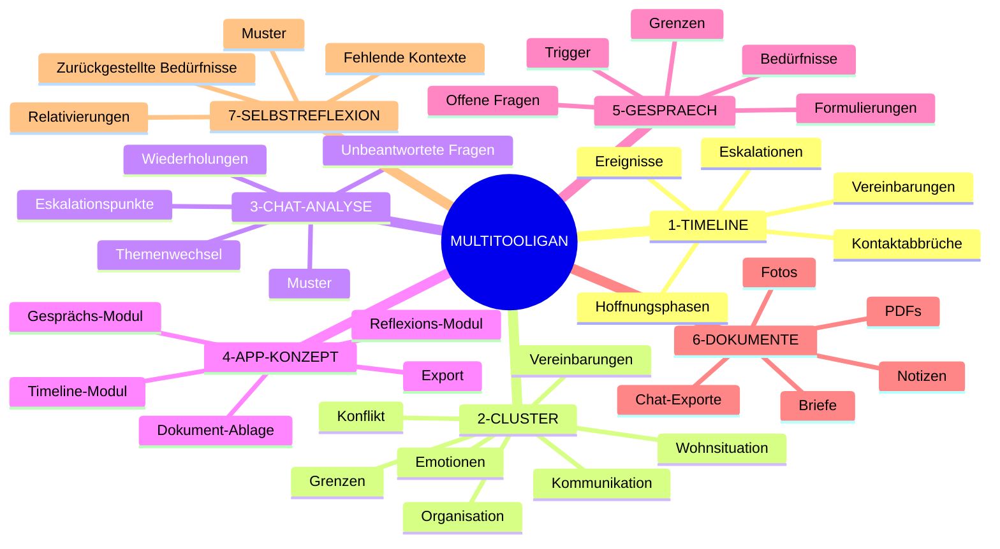
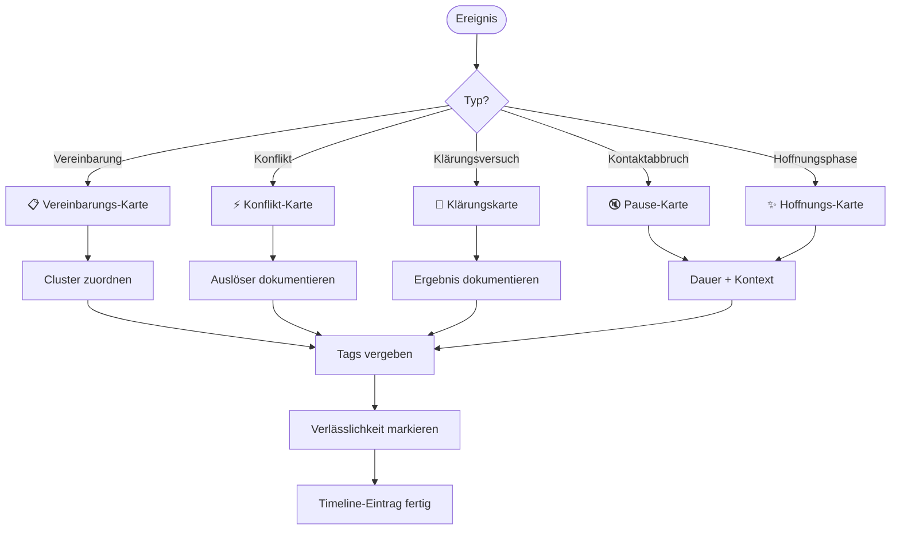
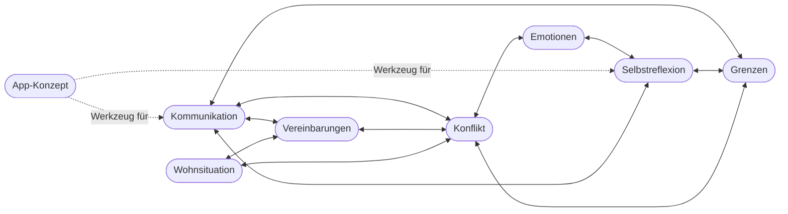
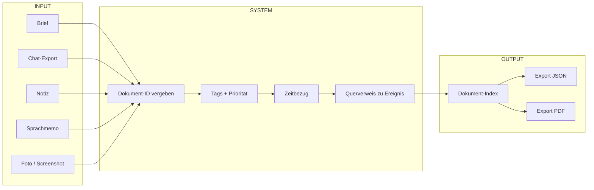
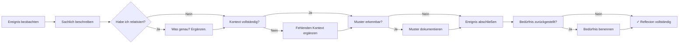
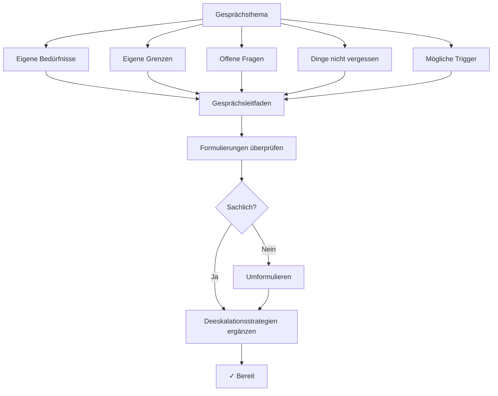

# MULTITOOLIGAN – Mermaid-Diagramme

Diese Datei enthält Diagramme für Obsidian, VS Code (Markdown Preview Mermaid) und andere Tools.
Kopiere einzelne Blöcke in dein bevorzugtes Tool.

---

## 1. Whiteboard-Überblick

---

## 2. Ereignis-Fluss / Kommunikationsmuster

---

## 3. Cluster-Verbindungen

---

## 4. Dokument-System

---

## 5. App-Modul-Übersicht

```mermaid
graph TD
    subgraph KERN
        T[Timeline-Modul]
        C[Cluster-Modul]
        R[Reflexions-Modul]
    end

    subgraph INTERAKTION
        G[Gesprächs-Modul]
        CH[Chat-Analyse]
    end

    subgraph ABLAGE
        D[Dokumente]
        EX[Export / Bericht]
    end

    subgraph SCHUTZ
        N[Notfall-Modus]
        PR[Privat-Modus]
    end

    T --> C
    T --> EX
    C --> R
    R --> G
    CH --> T
    CH --> C
    D --> EX
    N --> R
    PR --> D

    style KERN fill:#1a1a35
    style INTERAKTION fill:#12122a
    style ABLAGE fill:#12122a
    style SCHUTZ fill:#2a1a1a
```

---

## 6. Selbstreflexions-Zyklus

---

## 7. Gesprächsvorbereitung

